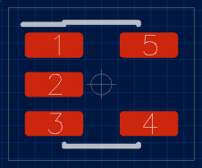

# About
Footag is a library for automatic generation of PCB footprints.

## Features
- SMD footprints calculated in line with IPC-7351B.
- Through-hole footprints calculated in line with IPC-7251 draft 1.
- Multiple output formats
  - KiCad 5.0
  - Horizon EDA
  - SVG, PDF and PostScript via *cairo*
  - *Your format*: user-friendly output API
- Designed as a self-standing library for use in applications.
  - Possibly useful for creating footprint wizards

# Quick start
        $ cd examples/
        $ make
        $ ./myproj
        $ ls -l myproj-out/

SVG (cairo), KiCad 5.0 and Horizon files are created. For example:

# Motivation
This software was created when the author needed a set of PCB footprints for an
upcoming project. There seemed to be no tool available with the following
properties:
- Support for multiple output formats
- Implementation of relevant standards
- Simple to customize library parameters, such as fabrication tolerances and
  artwork line width.
- Extendable with new component families and output formats
- Source code available (to judge footprint quality)
- Separation between component parameters, fabrication tolerances, project
  policy, artistic preferences, etc.

*Footag* tries to answer this need.

# Software requirements
A C99 compiler and GNU Make is required to compile the software.

Library requirements:
- `cairo` is required by the *cairo* output modules (SVG, PDF, PostScript).
- `libuuid` is required by the *Horizon* output module.

## Dependency installation
FreeBSD 11.2:

        # pkg install cairo e2fsprogs-libuuid gmake

Centos 7.4:

        # yum install cairo-devel libuuid-devel

# Technical Overview
These are the main software components of the library. The name is also the
linker symbol prefix.
* `footag_`: user description of component properties and library policy.
* `foot_`: performs calculations and generates geometry in an intermediate
   representation independent of the output format.
* `geom_`: intermediate footprint representation.
* `fout_`: API for transforming `geom` to EDA specific output format.

## `footag`
This is the application interface to the library. A footprint is constructed
from a set of parameters, named *tags*. For a given component family, some tags
are mandatory and some are optional. In addition, some tags are always optional
for all component families, such as silk screen line width, grid settings and
pad shape.

Each tag has a *name*, a *type* and a *value*. Tags are put on a list by the
user and provided to the `foot` interface to perform the calculations.

For more information of the `footag` interface and the available tags, see the
file [include/footag/footag.h](include/footag/footag.h).

### Example
Below is an example on how to define a CHIP component. It includes the
mandatory tags for a chip component.

        struct footag_item mytaglist[] = {
                { FOOTAG_FOOTYPE,       .data.i = FOOTYPE_CHIP },
                { FOOTAG_BODY_WIDTH,    .data.t = footol_auto( 1.60,  0.20) },
                { FOOTAG_BODY_LENGTH,   .data.t = footol_auto( 0.80,  0.20) },
                { FOOTAG_LEAD_LENGTH,   .data.t = footol_auto( 0.30,  0.20) },
                { FOOTAG_END, {0}},
        };

The function `footol_auto()` is used to create a dimension representation with
tolerances. `footol_auto()` can accept either a nominal value with plus/minus
parameter as in the example above, or as a (`min`,`max`) pair.

### Application access
The `footag` interface provides tables which describe the tags that are
applicable to each supported component. This can be used by the application to
avoid explicit knowledge of which tags belong to which component family.
Access by the application is done with the function `footag_getinfo()`. See
[include/footag/footag.h](include/footag/footag.h) and
[examples/showtags.c](examples/showtags.c).

## `foot`
This software component performs calculations given the user tags and generates
a `geom` representation. Internally, the process has abstractions to allow
using component family specific calculations and policies. Artwork calculations
are separated from land pattern calculations.

If you want to extend the library with a new component family, or investigate
artwork calculations, take a look at `struct foot_ops` in
[src/foot/foot_priv.h](src/foot/foot_priv.h) and how the functions are called.

The software could also be extended with support for other footprint or land
pattern standards or conventions. More generally, the `foot` implementation
tries to separate the following concepts:
- Land pattern calculation
- Pad shapes
- Artwork calculations
- Courtyard calculations

### Example
The following creates a `foot` context given the users tags and performs the
required calculations which are stored in the context.

        struct foot_ctx *foot;
        foot = foot_open(mytaglist);
        foot_calc(foot);

From the `foot` context, a `geom` context can be populated using `foot_gen()`:

        struct foot_geom *geom;
        geom = geom_open();
        foot_gen(foot, geom);

The `foot_gen()` draws shapes onto the `geom` *canvas*.

## `geom`
The intermediate representation allows to construct footprint
graphics from a set of primitives, such as lines, circles and
pads. Note that `geom` layer does not perform any footprint
calculations and does not know about tags. All calculations
and tag parsing are performed by the `foot` interface.

Some commen operations of the `geom` API are:
- `geom_line()` to create lines
- `geom_crect()` to draw a rectangle centered at current position.
- `geom_pad()` to place a pad with caller specified properties.

## `fout`
`fout` provides a common API for transforming a `geom` representation to a
target output format. It iterates over the `geom` internal structures and calls
the output format provided operations as appropriate.

### Example
To create a footprint file using the KiCad 5.0 output module and also generate
an SVG file, the following can be used:

        struct fout_ctx *fout;
        fout = fout_kicad5_open("myresc.kicad_mod");
        fout_gen(fout, geom, "RESC_1.6x0.8-deluxe");
        fout_close(fout);

        fout = fout_cairo_svg_open("myresc.svg", 3.0, 2.0, 10.0);
        fout_gen(fout, geom, "RESC_1.6x0.8-deluxe");
        fout_close(fout);

The same `geom` can be fed to multiple output modules as demonstrated above.
Output modules can have format specific parameters. The SVG output module
allows to set the cairo canvas dimensions and also has a scaling factor for the
users preference of SVG point to mm mapping.

### Horizon output module
A Horizon footprint (*package*) is a directory containing a file with the name
`package.json`. The directory name is provided as parameter to the function
`fout_horizon_open()`.  The output module creates the directory, creates the
file `package.json` and writes the JSON data to it.

Horizon padstacks for use with the created Horizon package are available
in the directory [misc/horizon-padstacks](misc/horizon-padstacks).

To use the generated footprint with *Horizon*, copy or link the package and
padstacks to a pool. For example:

        ln -s `realpath examples` $MYPOOLROOT/packages/examples
        ln -s `realpath misc/horizon-padstacks` $MYPOOLROOT/padstacks/footag

### Custom output modules
To get an idea of how and when the different operations of the `fout` interface
are called, the `fout_trace` output module can be studied. It will output
information on which functions are being called including parameters.

A good starting point when creating a new output module is to study the
[src/fout/kicad5.c](src/fout/kicad5.c) or [src/fout/cairo.c](src/fout/cairo.c)
output modules.

# Wishlist / TODO
- Support four-side land pattern (QFP, QFN).
- Improved tag value validation.
- Make the `footag_getinfo()` mechanism distributed. That is, allow the
  component implementation itself define and validate required and optional
  tags.
- Improve separation between artwork policy and pad calculation rules. Ideally
  support: *"I want a SOIC footprint which uses IPC-7351B for land pattern
  calculations and with silkscreen layer drawn using artwork policy X"*.
- Create a front-end tool which parses tags in text format and creates
  footprint files according to the users choice.
- Investigate if ESA ECSS-Q-ST-70-12 can be used as pattern calculation policy.

# See also
*Mentor Graphics* has published an excellent article series on the topic of PCB
footprint libraries:
[*"PCB Design Perfection Starts in the CAD Library"*](https://www.innofour.com/3783/news/literature/pcb-design-perfection-starts-in-the-cad-library/pcb-design-perfection-starts-in-the-cad-library-part-1).

Design of the `geom` interface has been inspired by the
[QEDA tool](https://github.com/qeda/qeda).

